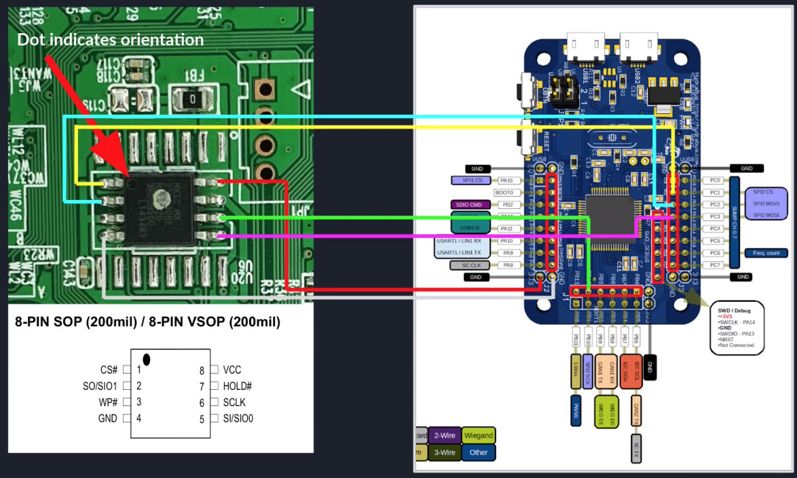

# SPI - Serial Peripheral Interface

Serial Peripheral Interface (SPI), is a type of communication protocol used primarily in microcontroller-based systems
The controller selects a chip it send and receive information to and from. NOR flash chips with an SPI interface are commonly used as firmware boot chip. SPI has one read and one write line. In QSPI mode, 4 lines are used in parallel.

SPI mainly involves four lines or wires:

* MOSI (Master Out Slave In): This is the line through which the master sends data to the slave.
* MISO (Master In Slave Out): Through this line, the slave sends data back to the master.
* SCLK (Serial Clock): This line is like a clock ticking, controlled by the master. It helps in timing the data transfer, ensuring both master and slave are synchronized.
* SS (Slave Select)/CS (Chip Select): When the master wants to talk to a particular slave, it uses this line to select the slave.

## Interact via SPI



* Connect to HydraBus and communicate via the SPI protocol

    ```ps1
    screen /dev/ttyACM0 115200
    spi
    
    # RDID Read Identification Sequence example
    [ 0x9f hd:3 ]
    
    # Read data from the beginning of the chip
    [ 0x03 0x00 0x00 0x00 hd:1024 ]
    ```

## Dump Firmware via SPI

### Dump using a Raspberry Pi

```powershell
sudo raspi-confi > Interface > SPI(P4)
# NOTE: might need a press/hold the reset button

# check
sudo flashrom -p linux spi:dev=/dev/spidev0.0,spispeed=1000

# dump
sudo flashrom -p linux spi:dev=/dev/spidev0.0,spispeed=1000 -r dump.bin
```

An ESP8266 and ESP32 have several SPI busses available in hardware, SPI0 is hooked up to it's own internal flash and is not intended for use, but the HSPI and VSPI busses can be used in combination with a SOIC-8 clamp to read from SPI NOR chips. cheap clips have a tendency to jump off the chips, pomona 5250 has a better grip.

```powershell
python ./esptool.py read_flash --spi-connection HSPI 0 0x400000 flash_dump.bin
```

### Dump with HydraBus

```ps1
flashrom --programmer serprog:dev=/dev/ttyACM0,spispeed=2M -c "MX25L12833F" --progress -r /tmp/image.bin
```

### Dump with BusPirate

```ps1
flashrom -p buspirate_spi:dev=/dev/ttyUSB0
flashrom -p buspirate_spi:dev=/dev/ttyUSB0 -c W25Q64.V

flashrom -p buspirate_spi:dev=/dev/ttyUSB0 -c W25Q64.V -r firmware.bin
```

## SPIFFS

```powershell
cd ~/.arduino15/packages/esp32/tools/esptool/2.3.1
python ./esptool.py -p /dev/ttyUSB0 -b 460800 read_flash 0x300000 0x0fb000 /tmp/spiffs.bin

cd ~/.arduino15/packages/esp32/tools/mkspiffs/0.2.3
./mkspiffs -u /tmp/data -p 256 -b 8192 -s 1028096 /tmp/spiffs/bin
```

## ESP32 Diagrams

Color coded which pins can be connected from the ESP HSPI pins to an SPI flash. The pink interfaces (DQ1 and DQ2) are optional, they are only used in QSPI mode.

<p align="center">
  
</p>

## References

* [Hardware Router CTF - Pen Test Partners - 9 mars 2020](https://www.youtube.com/watch?v=Bn5zajZ4I5E)
