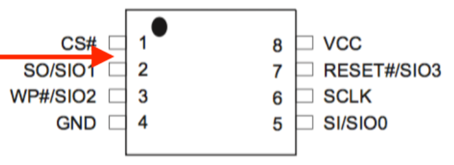
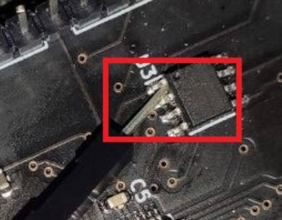

# Fault Injection

## Power / VCC - Voltage Glitch

Power glitch injection is a physical attack technique used to test and exploit vulnerabilities in electronic devices by causing controlled, temporary power disturbances.
A VCC glitch, also known as a supply voltage glitch, is a specific type of power glitch attack targeting the voltage supply (VCC) of a microcontroller or integrated circuit (IC) in electronic devices.

Most of the time the goal is one of the following:

* Re-enable debugging features (e.g: Trezor One wallet)
* Bypass secure boot
* Gain code-execution by glitching memcpy

**Tools**:

* [Faultier](https://1bitsquared.de/products/faultier) [FW](https://github.com/hextreeio/faultier/releases/tag/0.1.32)
* [PicoGlitcher v1.1](https://www.tindie.com/products/faulty-hardware/picoglitcher-v11/)
* [HydraBus](https://hydrabus.com/shop/)
* [ChipWhisperer-Pro](https://rtfm.newae.com/Capture/ChipWhisperer-Pro/)
* [ChipWhisperer-Husky](https://rtfm.newae.com/Capture/ChipWhisperer-Husky/)

**Voltage Glitching with Crowbars**:

```py
import faultier
import serial

ft = faultier.Faultier()
ser = serial.Serial(ft.get_serial_path(), baudrate=115200)
ser.timeout = 0.3

ft.configure_glitcher(
    trigger_source = faultier.TRIGGER_IN_EXT0,
    trigger_type = faultier.TRIGGER_PULSE_POSITIVE
    glitch_output = faultier.OUT_CROWBAR
)
ft.glitch(delay = 1000, pulse = 1)
print(ser.read(3))
```

**Challenges**:

* [Fiasco - Riscure Hardware CTF 2016](https://github.com/hydrabus/rhme-2016/blob/master/FaultInjection/Fiasco.md) - solved using HydraBus + Custom Board with MOSFET

    ```ps1
    gpio glitch trigger PB0 pin PC15 length 100 offsets 191200
    gpio glitch trigger PB0 pin PC15 length 100 offsets 191300
    ```

* [Fiesta - Riscure Hardware CTF 2016](https://github.com/hydrabus/rhme-2016/blob/master/FaultInjection/Fiesta.md)
* [Hardware Power Glitch Attack (Fault Injection) - rhme2 Fiesta (FI 100)](https://youtu.be/6Pf3pY3GxBM) - solved using a [custom code](https://gist.github.com/LiveOverflow/cad0e905691ab5a8a2474d483a604d67) running on a Xilinx FPGA
* [AVR Glitch: Modifying Code Execution Paths Using Only Voltage](https://flawed.net.nz/2017/01/29/avr-glitch-modifying-code-execution-paths-using-only-voltage/)
* [Hextree Glitch Tag](https://1bitsquared.de/products/glitch-tag) - The Hextree GlitchTag is a "totally not AirTag inspired" board for the nRF52832 microcontroller. It is intended as a target for the Hextree Faultier. It gives access to all pins that you need to learn basic fault-injection, including glitch characterization and so on. It also allows you to reproduce LimitedResult's APPROTECT bypass (that was also used to hack the AirTags) without needing to microsolder!

## Electromagnetic Fault

Electromagnetic Fault Injection is an advanced technique used in hardware security and testing, where electromagnetic pulses are used to induce faults in electronic devices

**Tools**:

* [findus](https://pypi.org/project/findus/) - Library to perform fault injection attacks with the PicoGlitcher, Chipwhisperer Husky or Chipwhisperer Pro
* [emfindus](https://pypi.org/project/emfindus/) - Add-on library to findus to perform electromagnetic fault injection (emfi) attacks with the ChipSHOUTER
* [Dirt cheap Electromagnetic Fault Injection](https://pedro-javierf.github.io/devblog/dirtcheapemfaultinjection/)

**Challenges**:

* [Fiesta - Riscure Hardware CTF 2016 - pedro-javierf](https://pedro-javierf.github.io/devblog/rhmefaultinjection/) - solved using a custom EMFI

## Clock Glitch

This technique involves momentarily disrupting or altering the clock signal of a device to induce errors or malfunctions in its operation.

**Challenges**:

* [Fiesta - Riscure Hardware CTF 2016 - jcldf](https://twitter.com/jcldf/status/1235859271176171521) - solved using a clock glitch

## Pin2pwn

[pin2pwn: How to Root an Embedded Linux Box with a Sewing Needle - Brad Dixon - Carve Systems - DEFCON 24](https://media.defcon.org/DEF%20CON%2024/DEF%20CON%2024%20presentations/DEF%20CON%2024%20-%20Brad-Dixon-Pin2Pwn-How-to-Root-An-Embedded-Linux-Box-With-A-Sewing-Needle-UPDATED.pdf)

In the case of an external SPI flash, it is possible for an attacker to short these pins :



The MCU will not be able to get data from the external flash and then show a stacktrace, get a shell in the bootloader or worst a root shell on the embedded Linux.

Here is a practical example, putting a cable between MOSI and Chip Select :



## References

* [Attacking the STM32F4 with the PicoGlitcher - Matthias Kesenheimer - December 15, 2024](https://mkesenheimer.github.io/blog/glitching-the-stm32f4.html)
* [Fault Injection using Crowbars on Embedded Systems - Colin O'Flynn](https://eprint.iacr.org/2016/810.pdf)
* [Glitching the Raspberry Pico with a Raspberry Pico - Matthias Kesenheimer - February 9, 2025](https://mkesenheimer.github.io/blog/glitching-the-rp2350.html)
* [Hardware Power Glitch Attack (Fault Injection) - rhme2 Fiesta (FI 100) - LiveOverflow -  16 june 2017](https://www.youtube.com/watch?v=6Pf3pY3GxBM)
* [PicoGlitcher PCB - A dirt chip fault-injection device - Matthias Kesenheimer - September 3 2024](https://mkesenheimer.github.io/blog/pico-glitcher-pcb.html)
* [pin2pwn: How to Root an Embedded Linux Box with a Sewing Needle - Brad Dixon - Carve Systems - DEFCON 24](https://media.defcon.org/DEF%20CON%2024/DEF%20CON%2024%20presentations/DEF%20CON%2024%20-%20Brad-Dixon-Pin2Pwn-How-to-Root-An-Embedded-Linux-Box-With-A-Sewing-Needle-UPDATED.pdf)
* [Replicant: Reproducing a Fault Injection Attack on the Trezor One - Voidstar - AUGUST 2022](https://voidstarsec.com/blog/replicant-part-1)
* [rhme-2016 write-up Fault Injection - hydrabus](https://github.com/hydrabus/rhme-2016/tree/master/FaultInjection)
* [Solving rhme fiesta from Riscure Hardware CTF 2016 with EM Fault Injection - Dangling Pointr - 2020, Oct 11](https://pedro-javierf.github.io/devblog/rhmefaultinjection/)
* [Your first Glitch/Voltage Fault Injection - hextree.io](https://app.hextree.io/courses/fault-injection-introduction/fault-injection-theory)
* [nRF54L15 Electromagnetic Fault Injection - Matthias Kesenheimer - June 17, 2025](https://blog.syss.com/posts/nrf54-emfi/)
* [STM32L05 Voltage Glitching - Matthias Kesenheimer - June 6, 2025](https://blog.syss.com/posts/voltage-glitching-the-stm32l05-microcontroller/)
